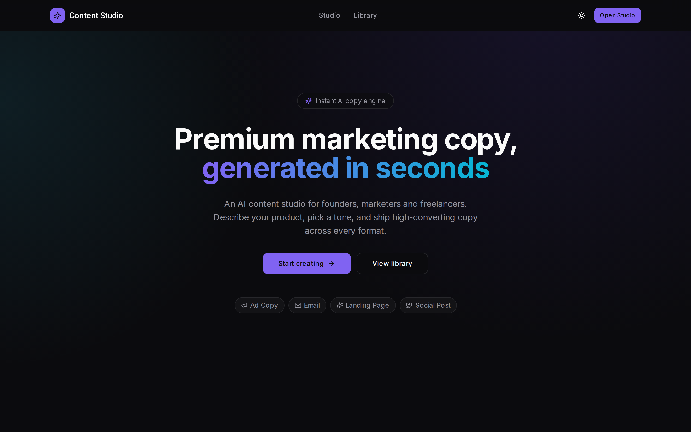
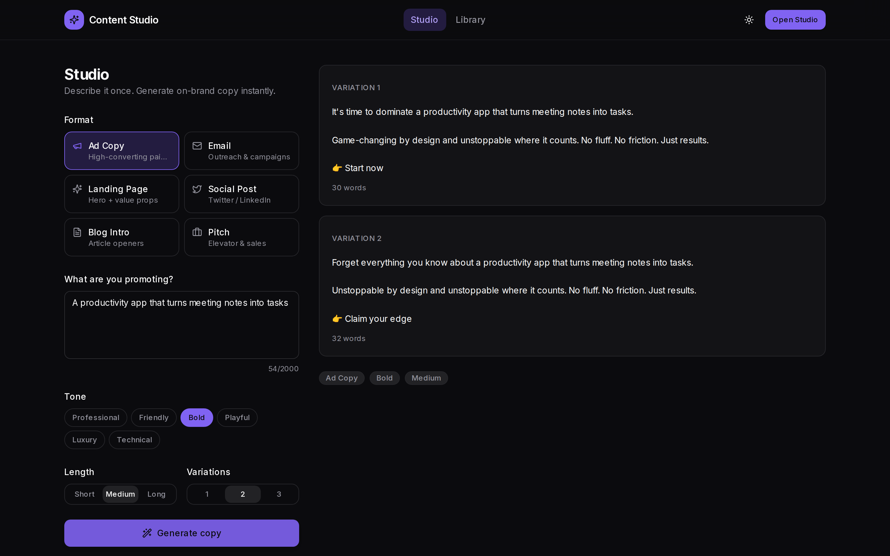
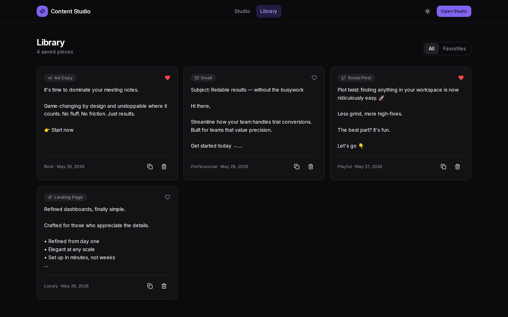

<div align="center">

# ✨ AI Content Studio

**Generate, refine, and organize premium marketing copy with AI.**

A polished, production-ready copywriting tool built with Next.js 14, TypeScript,
and Tailwind CSS. **Runs 100% free — no API key, no billing, no signup.**

**[🔗 Live Demo](https://ai-content-studio-navy-one.vercel.app)** · [Report Bug](https://github.com/Marawan-El-Safty/ai-content-studio/issues) · [Request Feature](https://github.com/Marawan-El-Safty/ai-content-studio/issues)


</div>

---

## 📸 Screenshots

### Landing


### Studio — generate on-brand copy


### Library — save & organize


---

## 🚀 Overview

AI Content Studio turns a one-line product brief into high-converting marketing
copy across six formats — ad copy, emails, landing-page heroes, social posts,
blog intros, and pitches. Pick a tone and length, generate multiple variations,
and save the winners to your personal library.

It's built to feel like a premium SaaS product: clean design system, dark mode,
smooth micro-interactions, skeleton loaders, and thoughtful empty states.

## ✨ Features

- **Six tuned copy formats** — each uses format-specific prompt engineering.
- **Tone & length control** — Professional, Friendly, Bold, Playful, Luxury, Technical.
- **Multiple variations** — generate up to 3 options per request and compare.
- **Content library** — save, favorite, copy, and delete pieces.
- **Zero-config & free** — a local copywriting engine generates everything
  in-process. No API keys, no billing, no rate limits, works offline.
- **Dark mode** — system-aware, persisted, no flash on load.
- **Type-safe end to end** — strict TypeScript, validated API route.
- **Accessible & responsive** — keyboard-friendly, mobile-first layout.

## 🛠️ Tech Stack

| Layer        | Tech                                                        |
| ------------ | ---------------------------------------------------------- |
| Framework    | [Next.js 14](https://nextjs.org/) (App Router, RSC)        |
| Language     | [TypeScript](https://www.typescriptlang.org/)             |
| Styling      | [Tailwind CSS](https://tailwindcss.com/) + CSS variables  |
| UI           | Custom shadcn-style components, [Lucide](https://lucide.dev/) icons |
| Animation    | [Framer Motion](https://www.framer.com/motion/)           |
| Engine       | Local tone/format-aware copy engine (no external API)      |
| Persistence  | localStorage (default) · [Supabase](https://supabase.com/) (optional) |
| Toasts       | [Sonner](https://sonner.emilkowal.ski/)                   |

## 🏗️ Architecture

```
src/
├── app/
│   ├── page.tsx            # Landing page (animated hero, features, CTA)
│   ├── studio/             # Core generation experience
│   ├── library/            # Saved content, favorites, filters
│   ├── api/generate/       # Validated server route → engine
│   ├── layout.tsx          # Theme provider + fonts + toaster
│   └── globals.css         # Design tokens (light/dark)
├── components/
│   ├── ui/                 # Reusable primitives (button, card, …)
│   ├── studio/             # Result card + skeleton
│   └── …                   # Navbar, theme toggle, reveal
├── hooks/
│   └── use-library.ts      # Persistence store (Supabase-ready shape)
└── lib/
    ├── ai.ts               # Local copywriting engine (tone/format aware)
    ├── content-types.ts    # Format definitions & prompt guidance
    ├── supabase.ts         # Browser client (null when unconfigured)
    └── utils.ts            # Helpers
```

**Design decisions worth noting**

- **Zero-dependency generation**: the copy engine runs in-process, so the app is
  free to host anywhere and never shows a broken screen — ideal for a live
  portfolio link.
- **LLM-swappable by design**: `lib/ai.ts` exposes the same async `generateCopy`
  contract an LLM would. Dropping in a hosted model later is a single-file change;
  the UI and API route stay untouched.
- **Separation of concerns**: generation logic lives in `lib/`; the UI never
  generates directly — it goes through a validated `/api/generate` route.
- **Drop-in Supabase**: the library store shape matches `supabase/schema.sql`, so
  swapping localStorage for an authenticated cloud table is a contained change.

## 🧑‍💻 Getting Started

### Prerequisites

- Node.js 18+ and npm

### Installation

```bash
git clone https://github.com/<your-username>/ai-content-studio.git
cd ai-content-studio
npm install
npm run dev   # that's it — no API keys required
```

Open [http://localhost:3000](http://localhost:3000).

### Environment variables

**None required.** The app is fully functional out of the box. The only
variables are optional and enable cloud persistence:

| Variable                        | Purpose                                  |
| ------------------------------- | ---------------------------------------- |
| `NEXT_PUBLIC_SUPABASE_URL`      | Enables cloud library (optional)          |
| `NEXT_PUBLIC_SUPABASE_ANON_KEY` | Supabase anon key (optional)              |

## ☁️ Deployment

Deploy to [Vercel](https://vercel.com/) in two minutes:

1. Push this repo to GitHub.
2. Import it in Vercel.
3. Deploy. ✅ (No environment variables needed — add Supabase keys only if you
   want the optional cloud library.)

For cloud persistence, create a Supabase project and run
[`supabase/schema.sql`](./supabase/schema.sql) in the SQL editor.

## 📜 Scripts

| Command             | Description                |
| ------------------- | -------------------------- |
| `npm run dev`       | Start dev server           |
| `npm run build`     | Production build           |
| `npm run start`     | Run the built app          |
| `npm run lint`      | Lint                       |
| `npm run typecheck` | Type-check without emitting |

## 📄 License

MIT — free to use, learn from, and build on.

---

<div align="center">
Built by <b>Marawan Elsafty</b> · Frontend & Fullstack Developer
</div>
